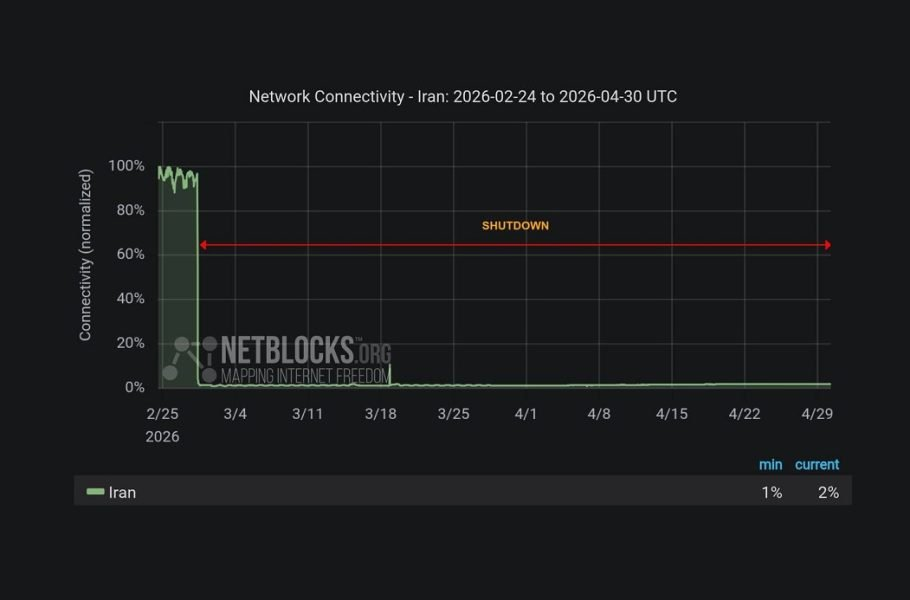

# Development Update & Technical Notes (As of May 6nd)

> [!IMPORTANT]
>
> I apologize for the substantial delay in releasing updates. Since March 2026, I have been without stable internet access in Iran (~70 days!!), which unfortunately resulted in a loss of my local development toolchains, as well as access to the latest information about updates, below is what you need to know (I try to keep this up-to-date):
> 
> 1- I am slowly updating my Minecraft mods: I am now working on the Minecraft 26.1 updates by leveraging GitHub Action Runners for compilation. Progress is slower than ideal due to the necessary reliance on external runners. (Note: I have recently learned that using GitHub Actions in this specific manner to circumvent local connectivity restrictions may violate platform policies and could potentially result in an account ban.)
>
> 2- How to Contact Me: To contact me, please use [GitHub Discussions](https://github.com/amiralimollaei/not-enough-vulkan/discussions) if my GitHub connection holds, otherwise, contact via Gmail.
>
> 3- I appreaciate your support: Please feel free to fork my Minecraft mods and update them yourselves!

