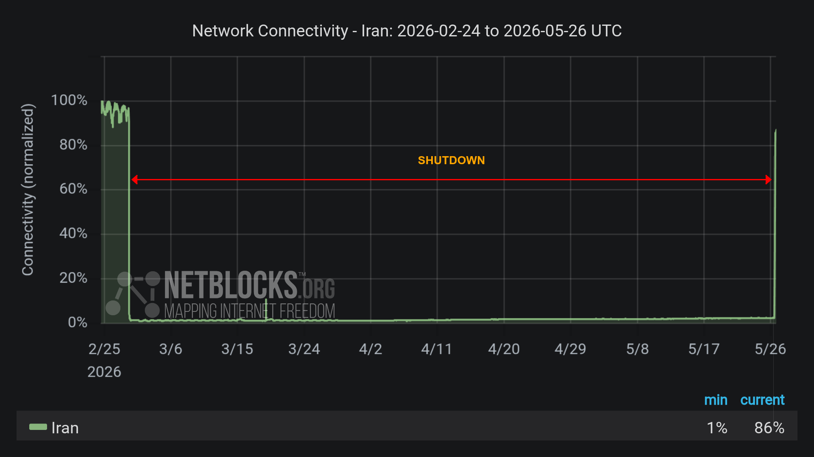

# Development Update & Technical Notes (As of May 15th)

> [!IMPORTANT]
>
> I apologize for the substantial delay in releasing updates. Since March 2026, I have been without stable internet access in Iran (~11 weeks!!), which unfortunately resulted in a loss of my local development toolchains, as well as access to the latest information about updates, below is what you need to know (I try to keep this up-to-date):
>
> NOTE: Github is being blocked again, the following may no longer be accurate.
> 
> 1- How am I updating my Minecraft mods with no internet?: I am working on the Minecraft 26.1.x updates by leveraging GitHub Actions to fetch all the files necessary for offline compilation, and using GitHub Actions again to upload them to Modrinth.
>
> 2- How to Contact Me: To contact me, please use [GitHub Discussions](https://github.com/amiralimollaei/not-enough-vulkan/discussions) if my GitHub connection holds, otherwise, contact via Gmail.
>
> I appreciate your support! Please feel free to fork my Minecraft mods and update them yourselves!

